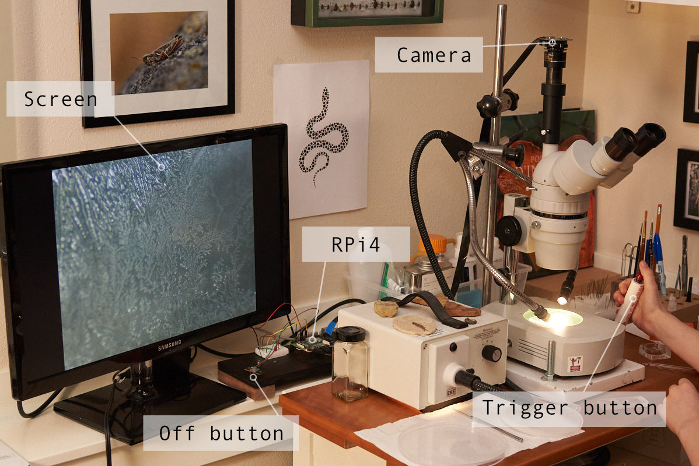

# raspi_camera_scripts

## Camera scripts for my Raspberry Pi computer

Early in 2020 I bought the Raspberry Pi High Quality Camera (https://www.raspberrypi.org/products/raspberry-pi-high-quality-camera/), and it turned out to be a great addition to my 20+ year old stereo-scope. The camera has a C-mount, and it was therefore easy to attach to the adapter that was already on the scope.

The live preview on an old computer screen is perfect for watching small critters in action with the kids. And taking pictures is very convenient after I attached a button switch on a long cable, with a short piece of PCV pipe as a handgrip. That's what the script "*camera_button_trigger_simple.py*" was written for.

Link to a page about this project on my web site: https://www.amphioxus.org/content/raspberry-pi-microscope-camera

# camera_button_trigger_simple.py

Shows a live full-screen preview, and then takes a picture when a button is pressed. Another button shuts the program down. Uses gpiozero module.

## Setup

The camera ribbon cable is attached to the port on the RaspberryPi.

## Trigger box

The circuit for the trigger box is very simple. Three GPIO pins are utilized:

* **GPIO output: LED** to indicate that picture is being taken
* **GPIO input: Trigger Button** for starting image acquisiton
* **GPIO input: Fuction Button** that can be used to stop the program (long-press)

### Circuit schematic

### microscope_camera.py

Not yet ready. Intended to one day replace *camera_button_trigger_simple.py* for also being able to save videos. Should feature an additional button to toggle between "Photo" and "Video" modes.

